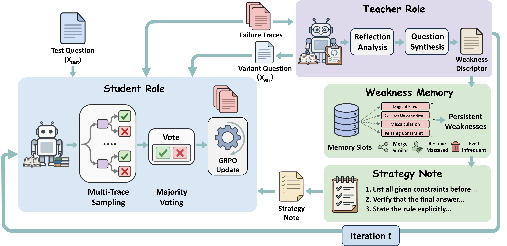
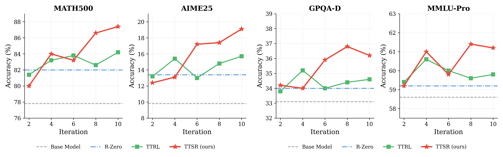

<h1>
  
  TTSR: Test-Time Self-Evolving via Reflection
</h1>

Official project codebase for the TTSR paper implementation on top of `verl`.

This repository provides a runnable training backend for the paper pipeline:
- Student adaptation with GRPO and majority-vote pseudo labels
- Teacher reflection from failed trajectories
- Teacher GRPO training for synthesis policy
- Reflection-guided variant synthesis
- Multi-round co-evolution loop with weakness memory




## Method Summary

TTSR targets two bottlenecks in test-time training on hard reasoning tasks:
- Noisy pseudo-label rewards on overly difficult questions
- Inefficient exploration without explicit failure diagnosis

The implemented loop follows the paper's reflect-then-synthesize design:
1. Student samples multiple rollouts and is trained with GRPO using majority-vote pseudo targets.
2. Teacher analyzes failed traces and extracts structured weakness descriptors.
3. Weakness memory is updated and compiled into strategy guidance.
4. Teacher synthesizes targeted variants near the Student capability frontier.
5. Student is trained again on mixed real + synthetic data for the next round.

## Repository Layout

```text
main/
  verl/                       # New verl backend
  ttsr/
    reward_managers.py        # Student and Teacher reward logic
    extract_failed.py         # failed trajectory mining
    reflect.py                # weakness reflection
    synthesize.py             # variant synthesis
    build_teacher_dataset.py  # teacher GRPO parquet builder
    build_round_dataset.py    # next-round student parquet builder
  scripts/
    setup_env.sh
    prepare_dataset.py
    train_solver.sh
    train_teacher.sh
    run_ttsr_loop.sh
  configs/ttsr.env.example
  assets/
```

## Environment Setup

```bash
cd /path/to/TTSR-mian
bash scripts/setup_env.sh
source .venv/bin/activate
```

What this installs:
- editable `verl` from `./verl`
- runtime deps: `vllm`, `pandas`, `pyarrow`, `regex`

## Data Preparation

Convert raw data (`json` / `jsonl` / `parquet`) to verl-compatible parquet:

```bash
python scripts/prepare_dataset.py \
  --input /path/to/raw.jsonl \
  --output_dir ./data/myset \
  --data_source ttsr_math \
  --question_keys question,problem \
  --answer_keys answer,solution,ground_truth
```

Outputs:
- `./data/myset/train.parquet`
- `./data/myset/test.parquet`

## Quick Start

### 1) Train Student once (GRPO)

```bash
MODEL_PATH=/path/to/model \
TRAIN_FILE=./data/myset/train.parquet \
VAL_FILE=./data/myset/test.parquet \
OUTPUT_DIR=./runs/solver_round1 \
bash scripts/train_solver.sh
```

### 2) Train Teacher once (GRPO)

```bash
MODEL_PATH=/path/to/model \
TEACHER_TRAIN_FILE=./runs/round_1/teacher_train.parquet \
TEACHER_VAL_FILE=./runs/round_1/teacher_train.parquet \
OUTPUT_DIR=./runs/teacher_round1 \
bash scripts/train_teacher.sh
```

### 3) Run full multi-round TTSR loop

```bash
cp configs/ttsr.env.example configs/ttsr.env
source configs/ttsr.env
bash scripts/run_ttsr_loop.sh
```

Per round (`run_ttsr_loop.sh`):
1. Train Student (GRPO)
2. Extract failed rollouts
3. Reflect + update weakness memory
4. Build Teacher train parquet
5. Train Teacher (GRPO)
6. Synthesize variants with Teacher
7. Build next-round Student train parquet

## Reward Design in Code

- Student reward manager: `TTSRMajorityRewardManager`
  - file: `ttsr/reward_managers.py`
  - logic: in-group majority pseudo-label reward

- Teacher reward manager: `TTSRTeacherRewardManager`
  - file: `ttsr/reward_managers.py`
  - logic: frontier proxy minus similarity penalty
  - key knobs: `FRONTIER_TARGET_SIMILARITY`, `TTSR_TAU`, `TTSR_LAMBDA`

## Main Config Knobs

From `configs/ttsr.env.example`:
- `MODEL_PATH`, `BASE_TRAIN`, `BASE_VAL`
- `ROUNDS`, `MAX_VARIANTS`, `REAL_RATIO`
- `ROLLOUT_N`, `TRAIN_BATCH_SIZE`, `N_GPUS`
- `TEACHER_TOTAL_STEPS`, `TEACHER_TOTAL_EPOCHS`
- `TEACHER_ROLLOUT_N`, `TEACHER_TRAIN_BATCH_SIZE`
- `TEACHER_MAX_TRAIN_SAMPLES`
- `FRONTIER_TARGET_SIMILARITY`, `TTSR_TAU`, `TTSR_LAMBDA`

## Outputs

Default root: `runs/ttsr_loop/round_*`

Each round typically includes:
- `solver/ckpts/`, `solver/rollout_data/`
- `failed_instances.jsonl`
- `reflections.jsonl`, `memory.json`, `strategy_note.txt`
- `teacher_train.parquet`
- `teacher/ckpts/`
- `variants.jsonl`
- `round_train.parquet`

## Notes

- This repository is implemented for the new `verl` architecture and does not depend on legacy TTCS code.
- `reflect.py` and `synthesize.py` require `vllm` at runtime.


